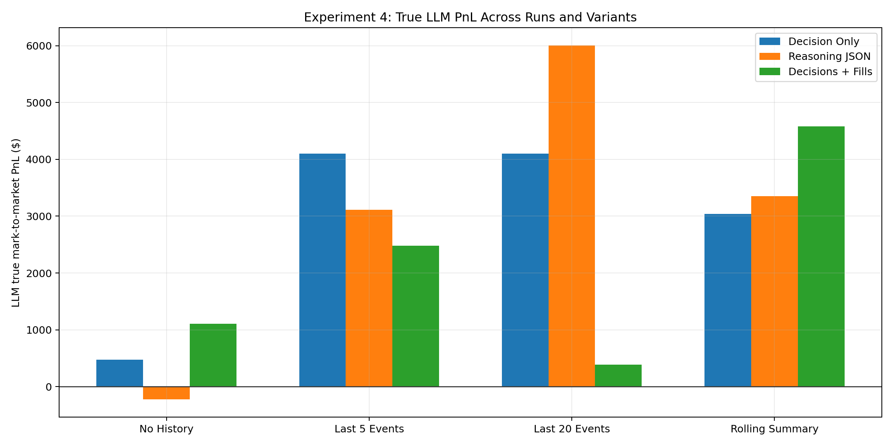
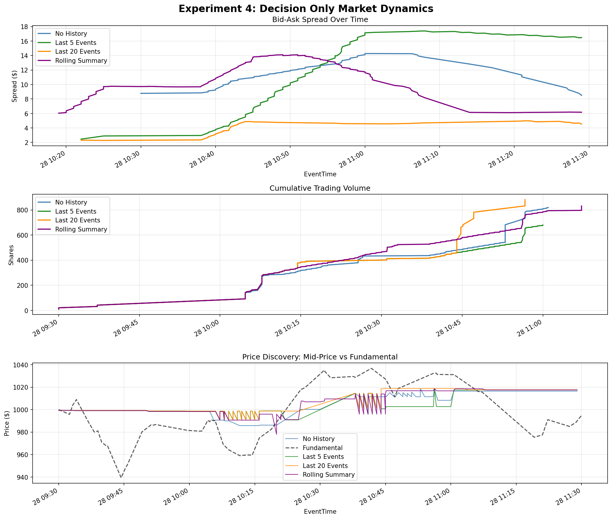
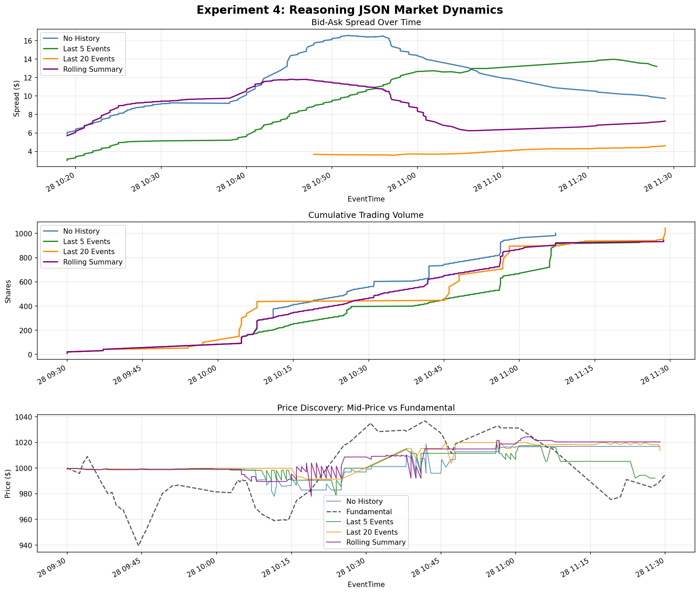
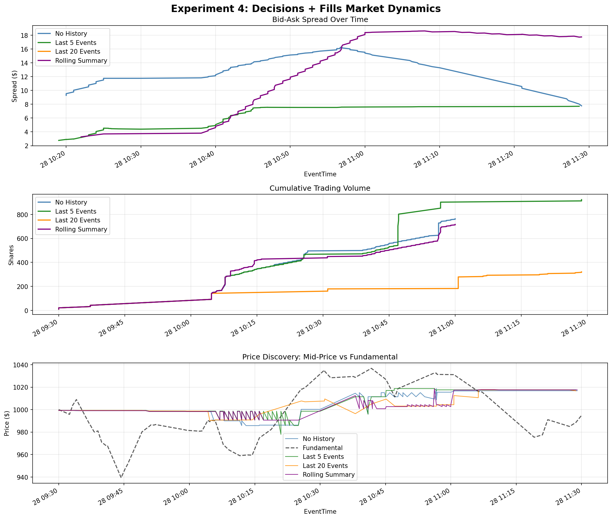
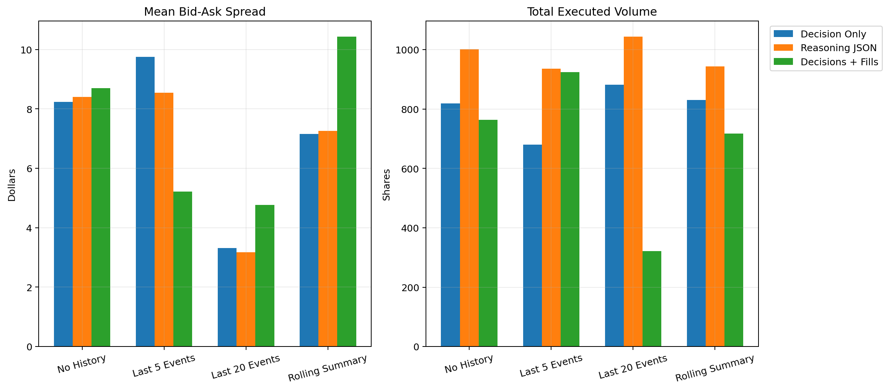

# Experiment 4: Full Memory Ablation Report

## 1. Scope

This report consolidates the three current Exp 4 representatives:

| Run | Prompt mode | Memory source | Purpose |
| --- | --- | --- | --- |
| Decision Only | Decision-only JSON | Own decisions | Main no-reasoning memory ablation baseline |
| Reasoning JSON | JSON with one rationale sentence | Own decisions | Tests whether no-reasoning output was too random |
| Decisions + Fills | Decision-only JSON | Own decisions + successful fills | Tests whether memory improves when it includes actual executions |

All runs use seed 12345, `gemma3:4b`, temperature 0.1, one LLM trader, and the same 9 traditional background agents.

PnL is computed from ABIDES' `ENDING_CASH` mark-to-market value. The custom `FINAL_VALUATION` event is not used in this report.

## 2. Market Dynamics

The plots below follow the same three-panel format used for Experiments 1-3: bid-ask spread, cumulative volume, and price discovery.

### 2.1 Decision Only

### 2.2 Reasoning JSON

### 2.3 Decisions + Fills

## 3. Cross-Run Metrics

| Run | Arm | True LLM PnL | Rank | Orders | BUY | SELL | Fills | Fill rate | Mean spread | Volume |
| --- | --- | --- | --- | --- | --- | --- | --- | --- | --- | --- |
| Decision Only | No History | $476.88 | 3 | 100 | 100 | 0 | 5 | 5.0% | $8.24 | 819 |
| Decision Only | Last 5 Events | $4,098.52 | 1 | 119 | 119 | 0 | 10 | 8.4% | $9.75 | 680 |
| Decision Only | Last 20 Events | $4,098.52 | 1 | 119 | 119 | 0 | 15 | 12.6% | $3.32 | 882 |
| Decision Only | Rolling Summary | $3,042.80 | 1 | 119 | 119 | 0 | 8 | 6.7% | $7.15 | 831 |
| Reasoning JSON | No History | $-226.35 | 7 | 118 | 105 | 13 | 10 | 8.5% | $8.40 | 1,001 |
| Reasoning JSON | Last 5 Events | $3,109.48 | 1 | 119 | 117 | 2 | 14 | 11.8% | $8.54 | 936 |
| Reasoning JSON | Last 20 Events | $6,004.31 | 1 | 117 | 98 | 19 | 15 | 12.8% | $3.18 | 1,044 |
| Reasoning JSON | Rolling Summary | $3,354.64 | 1 | 119 | 119 | 0 | 7 | 5.9% | $7.26 | 943 |
| Decisions + Fills | No History | $1,104.53 | 3 | 108 | 108 | 0 | 4 | 3.7% | $8.70 | 764 |
| Decisions + Fills | Last 5 Events | $2,478.41 | 1 | 81 | 81 | 0 | 12 | 14.8% | $5.21 | 924 |
| Decisions + Fills | Last 20 Events | $387.66 | 2 | 7 | 7 | 0 | 1 | 14.3% | $4.77 | 321 |
| Decisions + Fills | Rolling Summary | $4,576.82 | 1 | 119 | 119 | 0 | 10 | 8.4% | $10.43 | 717 |

## 4. Analysis

### 4.1 Decision-Only Baseline

The decision-only baseline keeps the prompt feature fixed and removes reasoning, so it is the cleanest memory ablation. All four memory arms are profitable. The best decision-only result is **Last 5 Events** at $4,098.52, while No History remains much lower at $476.88. This supports the idea that even compact or shallow memory helps the LLM place more effective orders than stateless decisions.

### 4.2 Reasoning Changes The Memory Effect

The reasoning-enabled variant changes behavior substantially. The best overall result in this report is **Last 20 Events** under Reasoning JSON at $6,004.31. However, reasoning is not uniformly better: **No History** falls to $-226.35. This suggests that reasoning interacts with the memory payload rather than acting as a general quality improvement.

The rationale field also increases generation cost and wall-clock time. It is useful as a diagnostic variant, but it should not be mixed into the primary no-reasoning memory ablation.

### 4.3 Successful-Trade Memory Is Useful When Compressed

The decisions-plus-fills variant gives the LLM access to its own actual successful trades. The strongest arm is **Rolling Summary** with $4,576.82. The rolling summary with fills is especially strong, suggesting that successful trade memory is more useful when summarized than when appended as a longer raw event stream.

The raw Last 20 Events arm behaves very differently in this setting: it submits only 7 orders and earns $387.66. That does not mean fills are harmful; rather, it suggests the raw combined memory payload can become too distracting or restrictive for this prompt format.

### 4.4 Memory Still Does Not Create Restraint

Across all variants, the LLM continues to submit an order at nearly every wakeup. The dominant action remains BUY in most arms. Memory changes price/quantity/fill outcomes more than it changes the model's willingness to trade.

### 4.5 Market Quality And LLM Profitability Remain Different

The market plots show that tighter spreads or higher volume do not guarantee better LLM PnL. Some arms improve liquidity-like metrics while increasing the LLM's inventory risk. Exp 4 should therefore report both market-level metrics and agent-level mark-to-market PnL.

## 5. Conclusions

1. **Decision-only memory remains the primary Exp 4 baseline.** It keeps prompt mode fixed and shows that memory improves results over No History.
2. **Reasoning should be interpreted as a separate prompt feature.** It produces the best single outcome, but it also creates the weakest no-memory outcome and changes runtime cost.
3. **Successful fills help most when compressed.** The best fills-aware result is Rolling Summary at $4,576.82.
4. **Raw memory is not always better memory.** Last 20 Events performs strongly with reasoning, but weakly when decisions and fills are combined as raw history.
5. **Agent PnL and market quality should both be reported.** Liquidity-like metrics explain market conditions, but they do not directly determine the LLM trader's profit.
