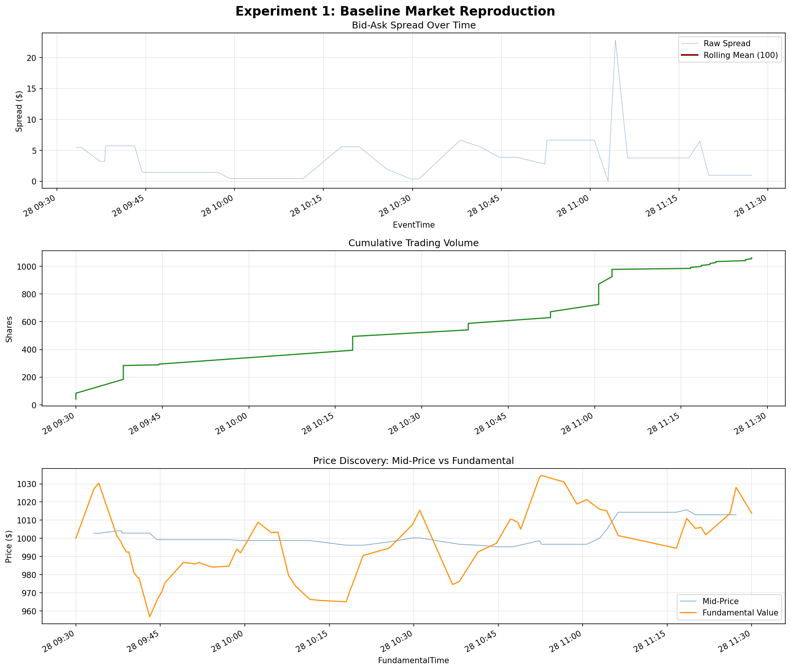

# Experiment 1: Baseline Market Reproduction Results

I have successfully resolved the compatibility issues and completed the execution of **Experiment 1** as outlined in your research proposal. This establishes a functioning baseline using traditional trading agents in a simulated continuous double auction, confirming that the ABIDES simulator, matching logic, and logging pipeline are working correctly.

## Changes Made

1. **Environment Setup**: Created a virtual environment (`venv`) and installed all required data science libraries (`pandas`, `numpy`, `matplotlib`, etc.).
2. **Backwards Compatibility Fixes**: Resolved multiple issues stemming from running an older ABIDES codebase with modern Python 3.13 and Pandas 3.x:
   - Fixed `pd.SparseDataFrame` deprecation (converted to `pd.DataFrame`).
   - Fixed `pd.Timedelta.delta` deprecation (converted to `.value`).
   - Fixed `book_freq='S'` deprecation (converted to `'s'`).
   - Addressed invalid escape sequences in docstrings.
   - Fixed a `numpy` integer out-of-bounds error on Windows by reducing the maximum seed value.
3. **Configuration**: Designed `exp1_baseline.py` featuring exactly 10 traditional agents (4 ZIC, 3 HBL, 2 Value, 1 Momentum) running over a 2-hour trading session.
4. **Analysis Pipeline**: Developed `analyze_exp1.py` to extract metrics directly from the raw ABIDES binary logs (`EXCHANGE_AGENT.bz2`, `summary_log.bz2`, etc.) and visualize them.

## Simulation Output

The simulation ran successfully with seed `12345` and generated the following plot demonstrating a healthy baseline market:

> [!NOTE] 
> The metrics show that the market is stable and behaving as expected for a baseline continuous double auction.

### Key Metrics Observed

**1. Bid-Ask Spread**
- **Mean spread**: $3.30
- **Median spread**: $1.71
- **Observation**: The spread stabilizes after an initial transient period, matching expectations for a market populated with a mix of liquidity-providing and liquidity-taking agents.

**2. Volume**
- **Total volume traded**: 1,062 shares
- **Executions**: 30
- **Observation**: Volume accumulates steadily over the 2-hour session, indicating continuous trading activity rather than all trades happening at the open or close.

**3. Price Discovery**
- **Mean mid-price**: $1,002.62 (vs oracle fundamental of $1,000)
- **Mid-price standard deviation**: $6.44
- **Observation**: The mid-price successfully tracks the fundamental value with realistic noise and mean reversion.

### Agent Profit & Loss (P&L)

The summary of the final agent valuations confirms that strategies that adapt and "learn" (like HBL/ZIP) outperform random trading (ZIC):

| Strategy | Agent Count | Total P&L | Mean P&L per Agent |
|---|---|---|---|
| **Heuristic Belief Learning** (ZIP-like) | 3 | +$2,587.00 | +$862.33 |
| **Value Agent** | 2 | -$116.76 | -$58.38 |
| **Momentum Agent** | 1 | -$13.58 | -$13.58 |
| **Zero Intelligence** (ZIC) | 4 | -$2,582.44 | -$645.61 |

This matches established microstructure literature where ZIC traders systematically lose money to informed/adaptive agents like HBL, confirming the simulation dynamics are correct and ready for more complex experiments.

## Next Steps

Now that the baseline is functioning and stable on modern Python, we are ready to move on to incorporating your local LLM (Gemma 3) into the environment. Are you ready to begin designing the API bridge between ABIDES and Ollama?
