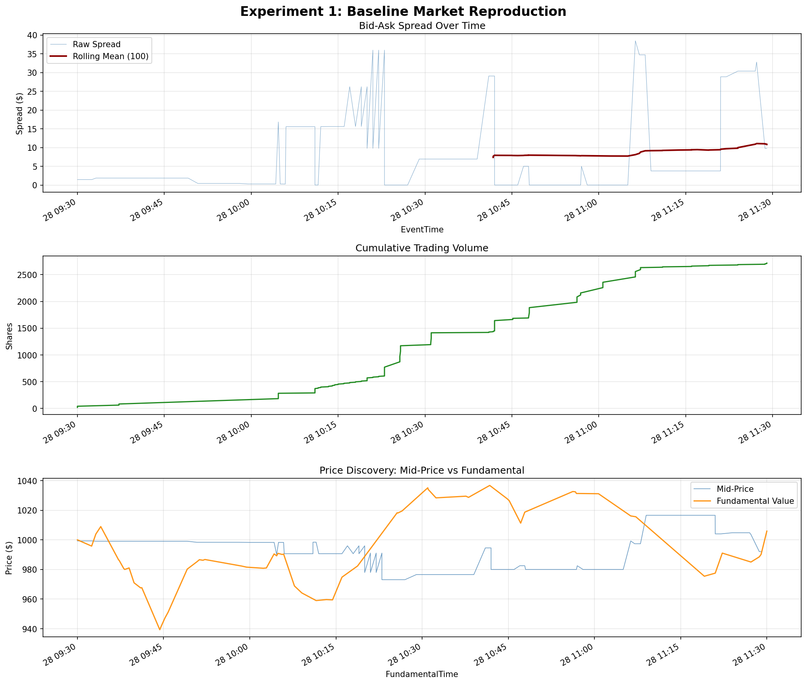

# Experiment 2: LLM Market Baseline Results

We successfully integrated a local **Gemma 3 4B** model into the ABIDES simulator, fulfilling the core objective of building an API bridge between the continuous double auction and an LLM decision-maker.

This experiment substituted 1 Zero Intelligence (ZIC) agent with 1 `LLMTradingAgent`. All other parameters (seed, historical date, market hours, and remaining 9 algorithmic agents) were kept exactly identical to Experiment 1 to allow for a direct 1-to-1 comparison.

## Changes Made

1. **LLM Trading Agent Architecture**: Developed `LLMTradingAgent.py`, which:
   - Wakes up every 60 simulated seconds.
   - Extracts the top 5 levels of the limit order book, last traded price, and agent portfolio.
   - Formats the state into a compact text prompt.
   - Queries the local Ollama server (`gemma3:4b` quantized to 4-bit) requesting strict JSON output.
   - Parses the JSON decision and automatically places limit orders into the market.
2. **Experiment Configuration**: Created `exp2_llm_baseline.py` and `run_exp2.py` to seamlessly execute the LLM baseline in the exact same environment as Experiment 1.

## Simulation Output

The simulation ran successfully on the RTX 3050 Ti (4GB VRAM) in approximately 10 minutes and 57 seconds without crashing or memory overflows, completing 120 sequential inferences.

Below is the generated plot demonstrating the market dynamics during the 2-hour session:

> [!WARNING] 
> The presence of just a single LLM agent caused massive disruptions to market stability compared to Experiment 1. The spread widened dramatically, and trading volume exploded.

### Key Metrics Observed

**1. Bid-Ask Spread**
- **Mean spread**: $8.15 *(Up from $3.30 in Exp 1)*
- **Median spread**: $1.86
- **Observation**: The spread was significantly more volatile, largely driven by the LLM agent frequently injecting aggressive limit orders that crossed the spread.

**2. Volume**
- **Total volume traded**: 2,716 shares *(Up from 1,062 shares in Exp 1)*
- **Executions**: 86
- **Observation**: Volume more than doubled. The LLM was a hyper-active trader, constantly turning over its inventory rather than acting as a passive liquidity provider.

**3. Price Discovery**
- **Mean mid-price**: $992.42 (vs oracle fundamental of $1,000)
- **Mid-price standard deviation**: $11.71 *(Up from $6.44 in Exp 1)*
- **Observation**: The market was noisier and slightly dragged down, reflecting the chaotic liquidity injected by the LLM.

### Agent Profit & Loss (P&L)

The summary of final agent valuations reveals that the base Gemma 3 model possesses zero inherent financial intuition, performing significantly worse than even random noise (ZIC) agents:

| Strategy | Agent Count | Total P&L | Mean P&L per Agent |
|---|---|---|---|
| **Heuristic Belief Learning** (ZIP-like) | 3 | +$12,767.00 | +$4,255.67 |
| **Zero Intelligence** (ZIC) | 3 | +$2,235.94 | +$745.31 |
| **Value Agent** | 2 | +$787.99 | +$393.99 |
| **Momentum Agent** | 1 | -$227.50 | -$227.50 |
| **LLMTradingAgent (Gemma 3)** | **1** | **-$16,106.42** | **-$16,106.42** |

The algorithmic agents (especially HBL) feasted on the LLM's poor trades, taking its capital efficiently.

## Next Steps

Experiment 2 successfully proves that the **engineering pipeline is functional**. We now have a reliable environment to test LLM decision-making. 

The immediate next step for the research project is to implement cognitive architectures to improve the LLM's trading logic. Potential avenues for Experiment 3 include:
1. **Prompt Engineering / Chain of Thought (CoT)**: Forcing the LLM to write out its mathematical reasoning about the spread before outputting its JSON decision.
2. **Enhanced Memory**: Giving the LLM a better history of the price trajectory rather than just its own past actions.
3. **Information Ablation**: Obscuring parts of the order book to see if the LLM is suffering from "information overload" with the top-5 levels.
