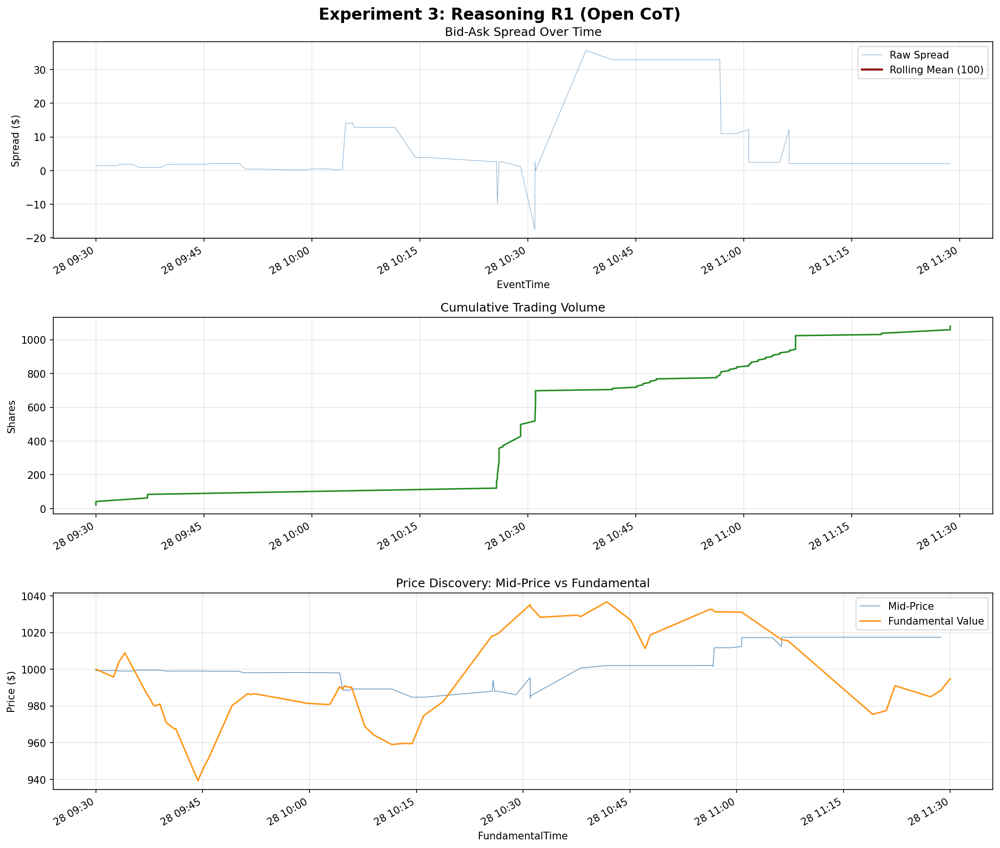

# Experiment 3: Reasoning R1 (Open CoT) — Results

## Simulation Overview
- **Agent Type**: `ReasoningAgentR1`
- **Seed**: 12345
- **Token Cap**: 256
- **Scaffold Type**: Open CoT ("Think step by step before acting. Keep it brief (2-3 sentences).")

## LLM Decision Quality Summary
- **Parse Failures:** 19 / 119
- **Network Errors:** 0 / 119
- **HOLD (Deliberate):** 0 / 119
- **HOLD (Fallback):** 19 / 119
- **Tokens Out (Median):** 62
- **Tokens Out (Mean):** 63.3
- **Tokens Truncated:** 0 / 119
- **Binding Rate:** 92 / 100 (92%)
- **Binding Ambiguous:** 0 / 119
- **Conclusion Source (Tag):** 0 / 119
- **Conclusion Source (Fallback):** 100 / 119

## Financial Performance
- **PnL**: -$5,362.67
- **Orders Placed**: 100 (excluding 19 fallbacks)
- **Rank**: 5th among strategies (worse than ZeroIntelligence, HeuristicBeliefLearning, Value, and Momentum).

## Key Findings
1. **No Truncation**: A token cap of 256 is entirely sufficient for `gemma3:4b` to output its reasoning and action. It averaged 63 tokens and maxed out below the cap.
2. **Parse Failures**: The unstructured "Open CoT" prompt caused the model to lose the strict action grammar in 16% of cases (19/119 parse failures). This is a stark regression from the Minimal-Raw arm, which had 0 parse failures.
3. **Direction Bias Persists**: The model remained aggressively active (0 deliberate HOLDs), continuing the bias seen in the Raw arm.
4. **Conclusion Fallback**: Because there are no scaffold tags, the conclusion text was always extracted from the last sentence (100/119). The 92% binding rate shows our classification mechanism works well for unstructured text, but the unstructured format itself degrades strict output compliance.

## Analysis Chart

