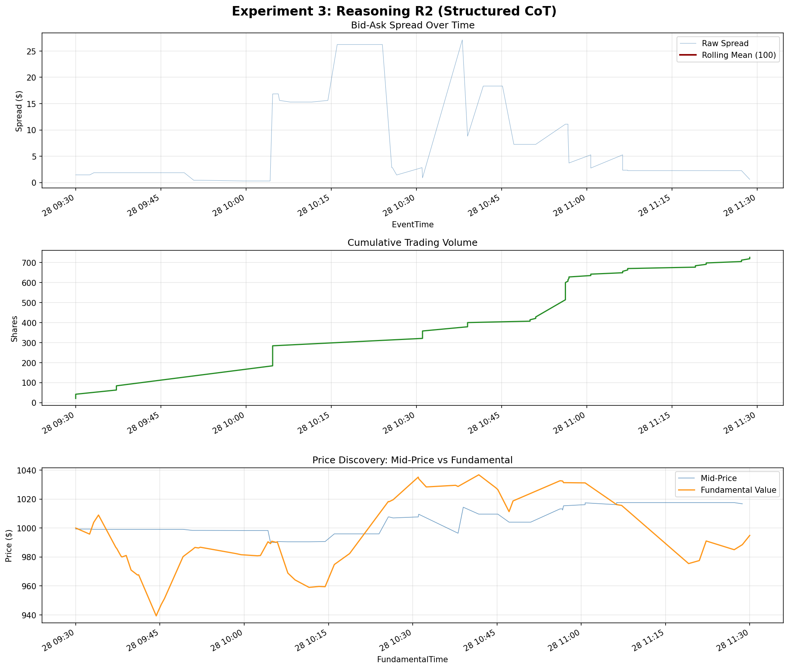

# Experiment 3: Reasoning R2 (Structured 3-Check CoT) — Results

## Simulation Overview
- **Agent Type**: `ReasoningAgentR2`
- **Seed**: 12345
- **Token Cap**: 256
- **Scaffold Type**: Structured 3-Check (`[EXPOSURE]`, `[EDGE]`, `[DECISION]`)

## LLM Decision Quality Summary
- **Parse Failures:** 0 / 119
- **Network Errors:** 0 / 119
- **HOLD (Deliberate):** 0 / 119
- **HOLD (Fallback):** 0 / 119
- **Tokens Out (Median):** 88
- **Tokens Out (Mean):** 89.0
- **Tokens Truncated:** 0 / 119
- **Binding Rate:** 119 / 119 (100%)
- **Binding Ambiguous:** 0 / 119
- **Conclusion Source (Tag):** 119 / 119
- **Conclusion Source (Fallback):** 0 / 119

## Financial Performance
- **PnL**: +$148.05
- **Orders Placed**: 119 
- **Rank**: 3rd among all agents, 2nd among the 5 strategies (behind only the top HBL agent).

## Key Findings
1. **Structure Solves Grammar Dropping**: Moving from R1's open CoT to R2's structured tags completely eliminated parse failures (dropped from 19 to 0). The model is fully compliant with the action grammar when its reasoning is cleanly separated into tagged steps.
2. **Perfect Binding**: The model generated the `[DECISION]` tag 100% of the time, and the conclusion text matched the final action 100% of the time. This proves the automated extraction via conclusion-only scoping is working flawlessly.
3. **Profitable Trading**: R2 achieved a positive PnL (+$148.05), a massive improvement over R1's -$5,583 loss. While we must verify this across seeds, it is a very strong initial signal that structured reasoning improves execution quality.
4. **Direction Bias Persists**: Despite the better execution and structure, the model still never output a deliberate `HOLD`. It traded on all 119 queries.

## Analysis Chart

