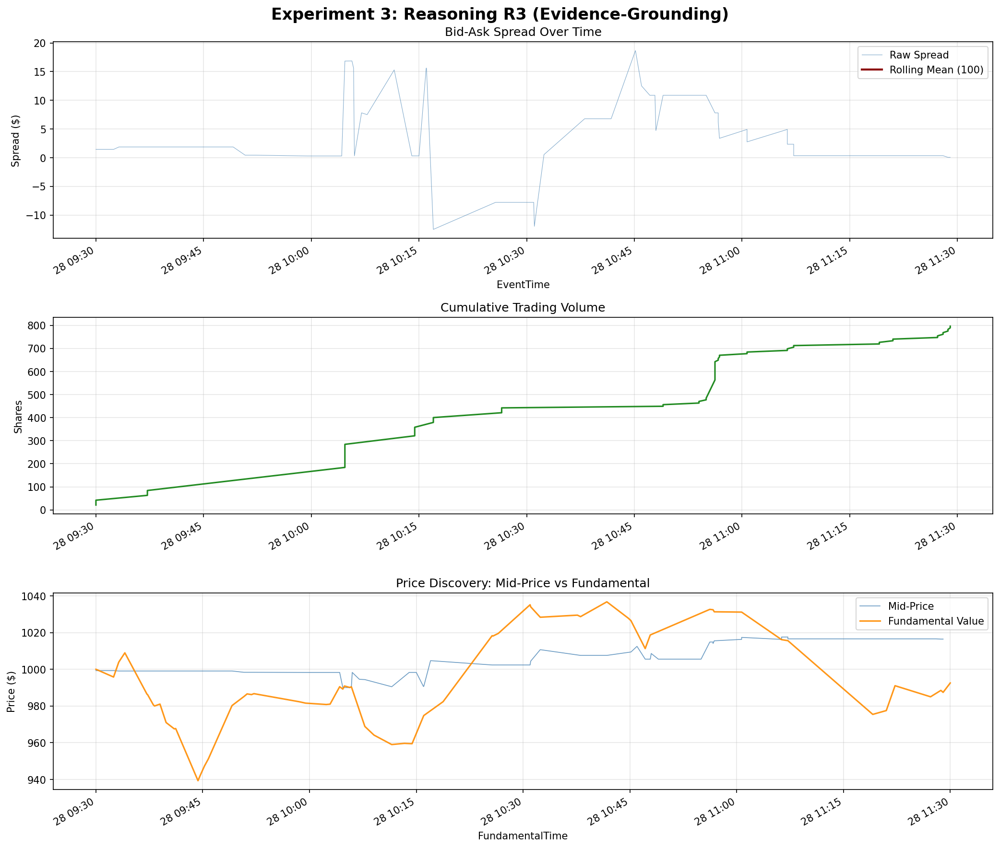

# Experiment 3: Reasoning R3 (Evidence-Grounding) — Results

## Simulation Overview
- **Agent Type**: `ReasoningAgentR3`
- **Seed**: 12345
- **Token Cap**: 256
- **Scaffold Type**: Structured + Evidence-Grounding (`[EXPOSURE]`, `[EDGE]`, `[VERIFY]`, `[DECISION]`)

## LLM Decision Quality Summary
- **Parse Failures:** 0 / 119
- **Network Errors:** 0 / 119
- **HOLD (Deliberate):** 0 / 119
- **HOLD (Fallback):** 0 / 119
- **Tokens Out (Median):** 122
- **Tokens Out (Mean):** 123.0
- **Tokens Truncated:** 0 / 119
- **Binding Rate:** 119 / 119 (100%)
- **Binding Ambiguous:** 0 / 119
- **Conclusion Source (Tag):** 115 / 119
- **Conclusion Source (Fallback):** 4 / 119

## Financial Performance
- **PnL**: +$793.92
- **Orders Placed**: 119 
- **Rank**: 2nd among all agents, 2nd among the 5 strategies (behind only the top HBL agent).

## Key Findings
1. **Best Financial Performance Yet**: R3 achieved a robust +$793.92 PnL, a massive leap over R2 (+$148.05) and R1 (-$5,583.09). This indicates that forcing the model to explicitly cite state numbers (`[VERIFY]`) fundamentally improved the *quality* of its trades, presumably by reducing hallucinated entries.
2. **Structure Maintained**: Parse failures remained completely eliminated at 0/119. 
3. **Perfect Binding**: 100% of decisions were successfully classified, proving the automated parsing framework handles even larger 4-step CoT outputs robustly. Only 4/119 queries required falling back to the last sentence when the `[DECISION]` tag was dropped or mangled.
4. **Token Generation Slower, but Cap Safe**: The addition of the `[VERIFY]` step bumped the mean tokens out from 89 (in R2) to 123. However, the 256 token cap was never hit, meaning the budget allocation remained safe without risking truncation.
5. **Direction Bias**: As seen in all previous runs, deliberate HOLD events remained at exactly 0. The model continues to execute a trade on every single query opportunity, meaning the improved PnL came entirely from making *better* trades, not *fewer* trades.

## Analysis Chart

